<picture>
  <source media="(prefers-color-scheme: dark)" srcset="dark.svg">
  <source media="(prefers-color-scheme: light)" srcset="light.svg">
  
</picture>

 

---

## 👋 About Me

I'm an **AI Solution Architect & Data Engineer** based in Jakarta, Indonesia — with a proven track record of building production-ready LLM chatbots, automated data pipelines, and enterprise analytics systems for government and energy sectors. I improve system efficiency by **20–35%** through AI-driven automation.

- 🎓 **B.S. Informatics Engineering** — Trisakti University *(4.0 GPA — Highest CGPA Award)*
- 🏢 Currently: **Lead AI Specialist** @ Nebula Data
- 🚀 Focus: LLM / RAG systems · Data Engineering · AI Presales & Prototyping
- 🌐 Portfolio: [gagaputra-portfolio.vercel.app](https://gagaputra-portfolio.vercel.app/)

---

## 🛠 Tech Stack

### AI & Machine Learning

### Data Engineering & Databases

### Backend & Frameworks

### Analytics & BI

### Design & Collaboration

---

## 💼 Work Experience

| Period | Role | Company |
|--------|------|---------|
| Dec 2025 – Present | **Lead AI Specialist** | Nebula Data, Jakarta |
| Oct 2025 – Dec 2025 | **Solution Engineer** | Talk-Cloud, Jakarta |
| May 2025 – Oct 2025 | **Risk Infrastructure** | PT Pertamina (Persero), Jakarta |
| Jan 2024 – Jun 2024 | **Data/Software Engineer** | Ministry of Finance RI, Jakarta |
| Aug 2023 – Present | **Lab Assistant** *(Multiple)* | Trisakti University, Jakarta |

### 🔥 Key Highlights

- **PT Pertamina** — Built ARA (AI chatbot with dual-agent architecture) for ERMS, improving task efficiency by **20–30%**; developed Python-integrated Power BI Dashboard with **99% data accuracy**
- **Ministry of Finance RI** — Achieved **98% accuracy** in legal document parsing; reduced retrieval time by **25%** and cut drafting time by **30–35%**
- **Nebula Data** — Leading AI presales by translating client business needs into scalable, production-ready AI solutions
- **Talk-Cloud** — Designed and implemented system integrations for operational efficiency and scalability

---

## 🎓 Education & Certifications

**Trisakti University** — Bachelor of Informatics Engineering *(Aug 2021 – Aug 2025)*
- 🏆 Awarded for **Highest CGPA** among students
- 📊 Achieved **4.0/4.0 GPA** in Semester 4 & 7
- 🔬 Participated in lecturer research on **LLM-driven RAG chatbots**

### 📜 Certifications

| Certification | Issuer | Year |
|--------------|--------|------|
| ACA Big Data Certified | Alibaba Cloud | 2024 |
| Neo4j Certified Professional | Neo4j | 2024 |
| SQL Certification | HackerRank | 2024 |
| SQL and Relational Databases 101 | IBM / Cognitive Class | 2025 |
| Python 101 for Data Science | IBM / Cognitive Class | 2025 |

---

## 🚀 Featured Projects

### 🤖 ARA — Artificial ERMS's Agents *(2025)*
> Advanced AI assistant with **dual-agent architecture** for PT Pertamina's Enterprise Risk Management System (ERMS). Built to provide comprehensive support to all Pertamina staff.

### 🧠 Mentor AI *(2025)*
> Conversational AI assistant designed to offer **mental health insights and support**. Built with LLM-powered empathetic dialogue.

### 📊 Pension Fund System *(2023)*
> **Django-based** website for recording pension fund transactions — improved data management efficiency by **30%** through automated data entry and reporting.

### 🎨 Oh Cleaner *(2023)*
> **Figma** prototype for a mobile cleaning-service booking application.

---

## 🏆 Leadership & Organizations

| Period | Role | Organization |
|--------|------|-------------|
| Jul 2024 – Jul 2025 | **Head of Research & Technology** | Informatics Engineering Student Association Board |
| Jul 2023 – Jul 2024 | **Head of Curriculum** | Google Developer Student Clubs — Trisakti |

---

## 📊 GitHub Stats

---

## 📬 Get In Touch

| Platform | Link |
|---------|------|
| 📧 Email | [gagaputra626@gmail.com](mailto:gagaputra626@gmail.com) |
| 💼 LinkedIn | [linkedin.com/in/gagah-putra-bangsa](https://www.linkedin.com/in/gagah-putra-bangsa/) |
| 🌐 Portfolio | [gagaputra-portfolio.vercel.app](https://gagaputra-portfolio.vercel.app/) |
| 📱 Phone | +62 81908370510 |

---

*"Building intelligent systems that bridge human needs and cutting-edge AI."*

